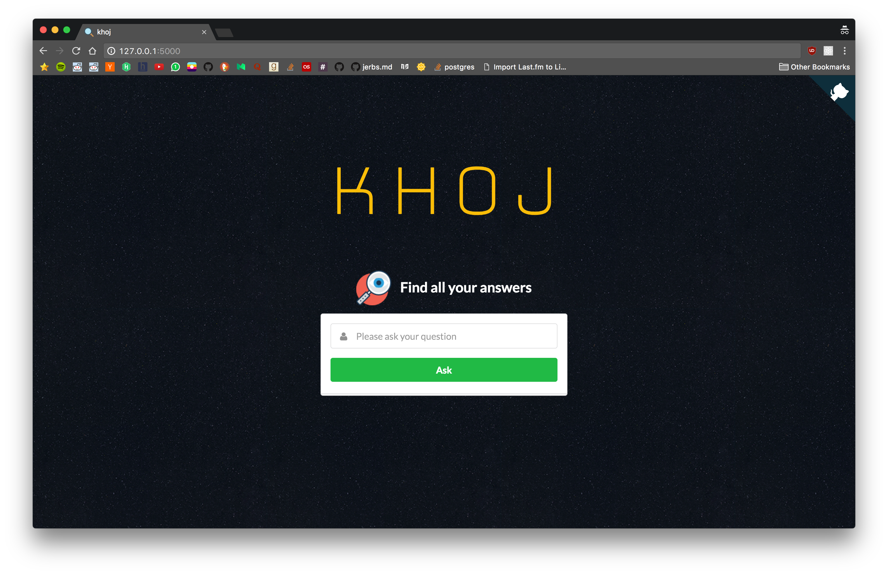
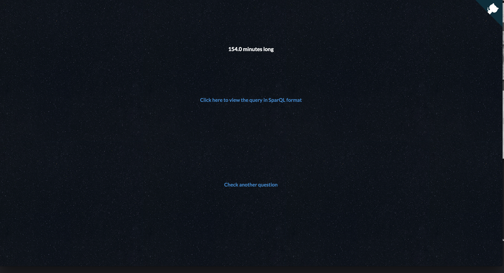
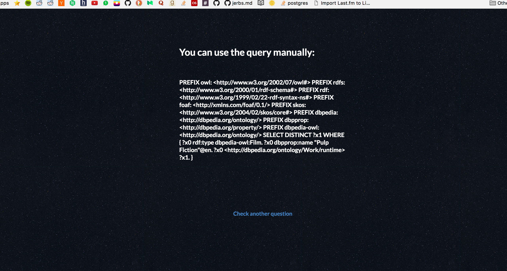

# khoj
CSE SNU Project Final Year

# About khoj

Natural language phrases to sparQL made easy. 

Write text

# Instructions to run

- Create a virtualenv using `virtualenv venv -p /usr/bin/python2.7`
- source venv/bin/activate
- pip install -r requirements.txt

- NLTK_DATA_PATH = ['/Users/ninjaPython/Work/FinalYearCSE/data'] change it to your own NLTK data path in db/settings.py
- Run python main.py
- Open localhost:5000 in your browser

# Screenshot

